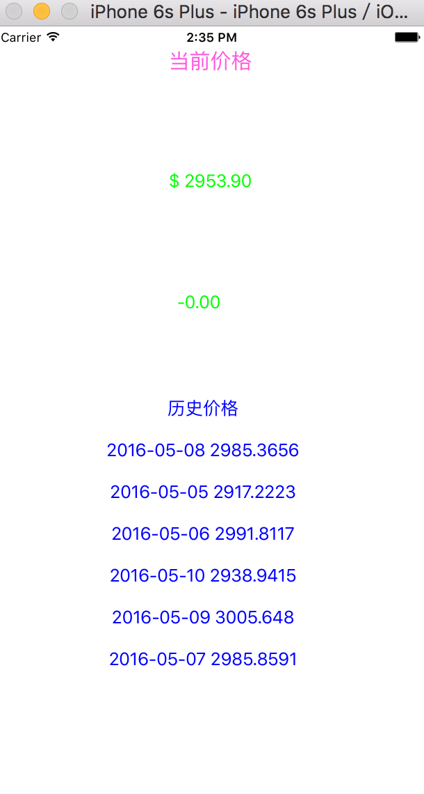

#  比特币实时价格 APP

入门系列之"比特币实时价格APP"实战, 第三方库SwiftyJSON解析接口json数据, 语言 Swift2.2, 环境 XCode7.2.1, 附详细注释

运行界面如下: 当前价格,涨跌幅度,过去五天价格列表

[原博客教程地址,点击这里](http://www.jianshu.com/p/ae9a579905e0)

第三方库使用 CocoaPods 集合,大家可以使用这个预配置好的工程进行开发练习,[点击下载](BitPrice.zip)

喜欢的话,欢迎 **Star**
